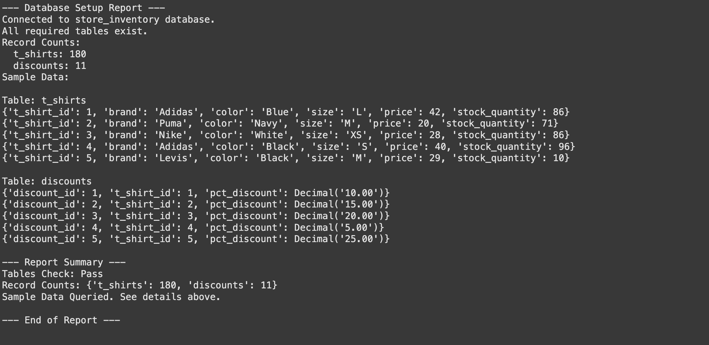
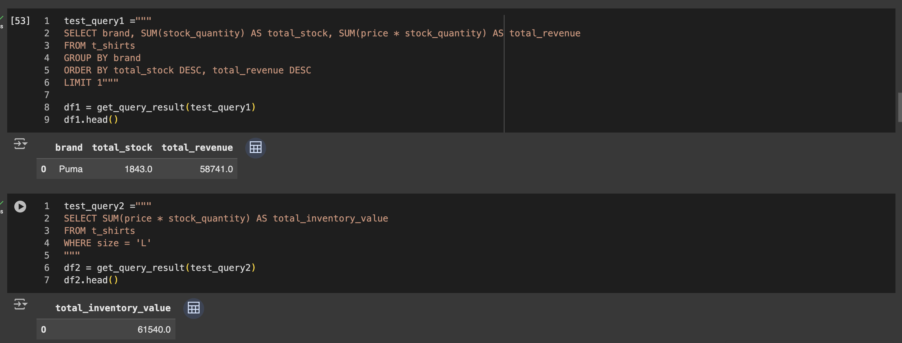
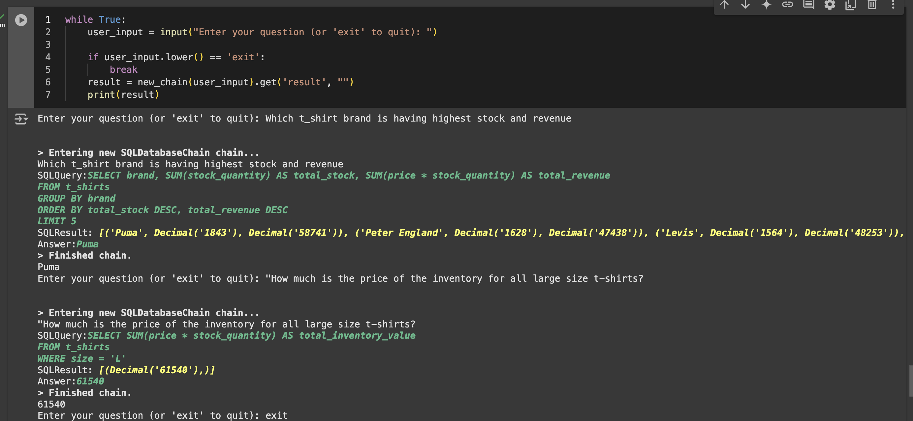

# 🧠 Intelligent Query Engine: A Modern AI-Powered Query System

This repository hosts the **Intelligent Query Engine**, an AI-driven query solution that integrates advanced natural language processing with robust database querying. The system leverages state-of-the-art AI models, vector databases, and traditional relational databases to provide seamless, intelligent interactions with your data.

## 🌱 Features

- **Google Gemini and Hugging Face Embeddings**: Harnesses the power of cutting-edge language models to understand natural language queries and convert them into precise SQL statements.
- **ChromaDB for Vector Storage**: Efficiently stores and retrieves embeddings for context-aware querying and semantic search.
- **MySQL Backend**: Queries structured data stored in a traditional relational database, ensuring compatibility with existing workflows.
- **LangChain Integration**: Chains complex logic and workflows, enabling multi-step querying and decision-making.
- **Notebook-Based Development**: Experimentation and prototyping in a flexible, interactive environment.

## 💡 Key Capabilities

1. **Natural Language to SQL**: Users can ask questions in plain English, and the engine generates accurate SQL queries to fetch results from MySQL.
2. **Semantic Search**: Find relevant information using vector-based similarity searches stored in ChromaDB.
3. **Dynamic Context Management**: Adapts to user queries with contextual understanding powered by Google Gemini and Hugging Face embeddings.
4. **Scalability**: Designed to handle large datasets and complex queries with ease.
5. **Modular Design**: Extensible architecture for integrating additional AI models or database systems.

## ⚙️ System Flow Chart

This structure provides a high-level overview of how the various components interact in your Intelligent Query Engine project. 

**Intelligent Query Engine**:

```
                    +---------------------+
                    |    User Query       |
                    | (Natural Language)  |
                    +----------+----------+
                               |
                               v
                   +-------------------------+
                   | Google Gemini / Hugging |
                   | Face Embeddings (NLP)   |
                   +-----------+-------------+
                               |
                               v
               +------------------------------+
               |      LangChain (Workflow)    |
               +-----------+------------------+
                               |
           +-------------------+------------------+
           |                                      |
           v                                      v
  +------------------+                   +-------------------+
  |   ChromaDB       |                   |   MySQL Database  |
  | (Vector Storage) |                   |  (Structured Data)|
  +------------------+                   +-------------------+
           |                                      |
           +-------------------+------------------+
                               |
                               v
                   +--------------------------+
                   |  SQL Query Generation    |
                   |  (Data Fetching)         |
                   +--------------------------+
                               |
                               v
                   +--------------------------+
                   |    Final Results         |
                   |   (Returned to User)     |
                   +--------------------------+
```

### 🔄 Flow Explanation:
1. **User Query (Natural Language)**: The user inputs a query in natural language.
2. **Google Gemini / Hugging Face Embeddings**: These models process and embed the query into a format suitable for understanding and further processing.
3. **LangChain**: Orchestrates the multi-step process and integrates different components.
4. **ChromaDB**: Stores vector embeddings for context-based search, aiding in query understanding.
5. **MySQL Database**: The relational database where the actual data resides.
6. **SQL Query Generation**: Translates the processed natural language query into a precise SQL statement.
7. **Final Results**: The result of the query execution is returned to the user.

## ✅ Applications

- Business Intelligence: Ask complex questions about your data and receive actionable insights.
- E-commerce: Query inventory, pricing, and sales data in natural language.
- Research: Extract patterns and trends from structured datasets without SQL expertise.
- Data Analytics Teams: Bridge the gap between technical and non-technical users by democratizing access to data.

## 🚜 Getting Started

This repository includes an initial implementation in a notebook environment. Transitioning to a production-ready system will involve deploying the components to a scalable infrastructure.

### 🛠 Components
1. **AI Model**: Google Gemini and Hugging Face embeddings (`sentence-transformers/all-MiniLM-L6-v2`) for query understanding.
2. **Vector Database**: ChromaDB for storing and retrieving embeddings.
3. **Relational Database**: MySQL for structured data storage.
4. **Orchestration**: LangChain for chaining steps like embedding retrieval, query generation, and data fetching.

### 🔬 Experiment Outcomes:

- ⛃ Snapshot of Database 



- 👨🏻‍💻 Output from the raw SQL query.



- 🦾 Output from the AI (LLM) prompt query



##### Note: Utilized Google's `T4 GPU` to successfully complete this task.
